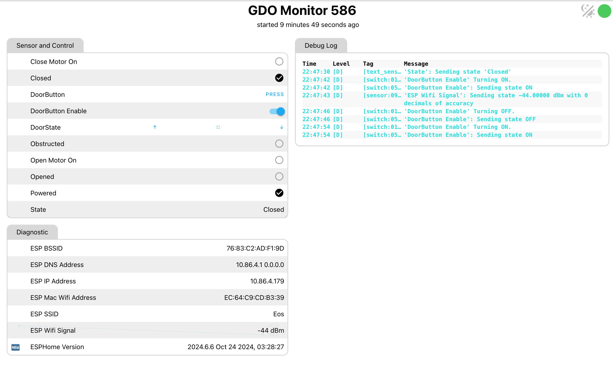
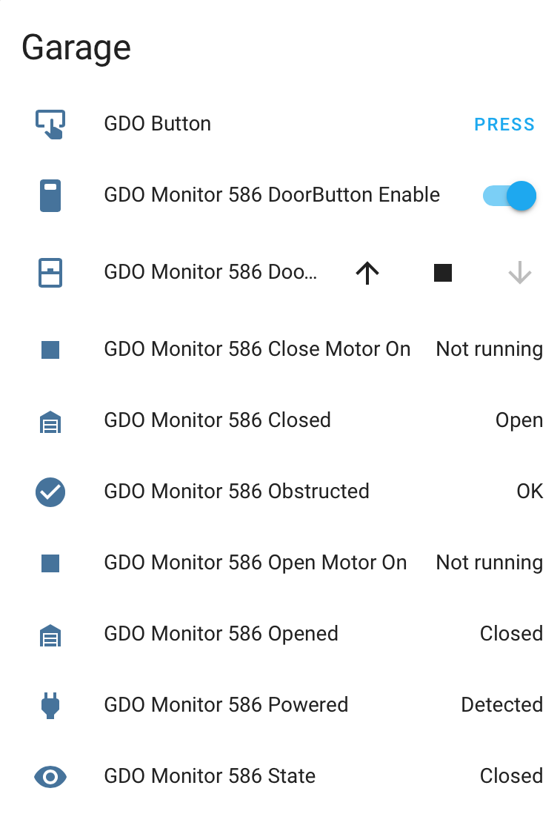
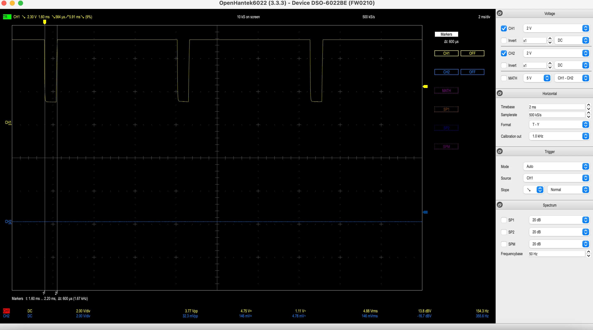
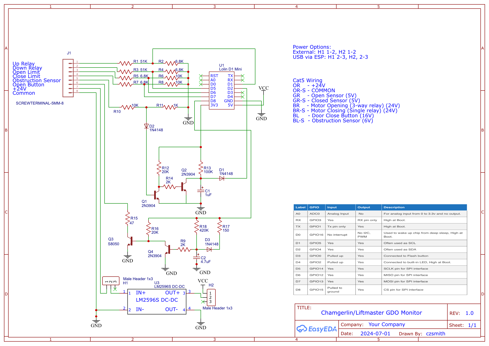
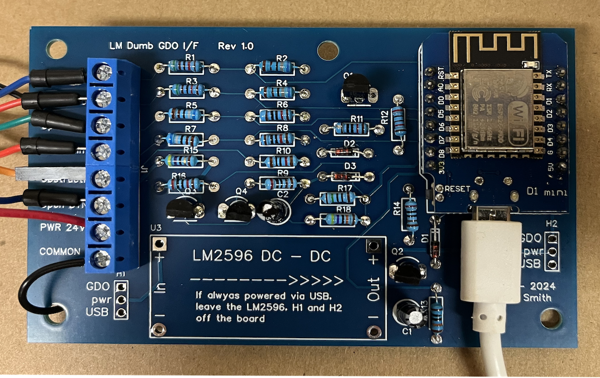

# GDO
Garage Door Opener - Monitor and Control using ESPHome - Hardwired

## Old Liftmaster GDO
My house is approaching 30 years old and has the original Liftmaster garage door opener (GDO).

I wanted to be able to know when it opens or closes and be able to do so remotly.  So many projects with this exact goal, including a popular [rat-ratgdo](https://github.com/Kaldek/rat-ratgdo) project for newer models.

Alas, I have a stone-age model which has only a pushbutton for open/stop/close and the obstructed sensors.  A while ago, I proposed to access the important state information by tapping into the signals on the circuit board.  (See this [reddit post](https://www.reddit.com/r/homeassistant/comments/1dofeek/comment/la9jz4z/?context=3).)

While this porject is for my Liftmasters, Chamberlain manufactured similar GDOs under the Sears Craftsman and Raynor brands as well.

### Liftmaster / Chamgerlain / Craftsman / Raynor Warraty
These are so old that nobody likely has one under warranty.  Still, modifing your GDO is guaranteed to void your warranty.

### My Warranty
**There is none.**
**Anything you do is on you and at your own risk.**
**Beware that the GDO and circuit board have high voltage (120V) which can be dangerous or deadly**
**Don't do anyting in the GDO or on the GDO logic board while the GDO is powered.**

### Goal
My intent with this project is to bring out details about the status and operation of my GDOs:
* State of the GDO: Open, Opening, Closed, Closing or partially open.
* State of the obstruction sensor
* If partially open, how much?
* Be able to open or close the door remotely.
* Provide the ability to disable remote door operation.
* Prevent (as much as possible) door operation in the event of a software failure.
  
### How it Looks Locally and in Home Assistant
The point of this exercise to make the GDO status visible to a web browser and to Home Assistant.

Using the built-in ESPHome web server (without any CSS to make it prettier), the project presents:

In the HA app, the device presents itself as:

Eventually, I will clean up the presentation.

## Getting the Signals
**NOTE: This applies to the Liftmaster logic boards with the RED program button.  Conceptually, it should be the same for boards with other programming colors that have a simple door button where shorting the button wires operates the door.**

I've already pulled the circuit board to replace the notorious capacitor that prevents radio remotes from working. I figured all the important information was available on the main circuit board, so why bother with external components?

| Signal               | Interpretation | Board Function | Wire Color   | 
| -------------------- | -------------- | -------------- | ------------ | 
| Power                | +24V Nominal   | Powers logic   | Orange       |
| Common               | Ground         | You have to ask? | Orange/White |
| Door Open Limit      | +5V when NOT open, 0V Open | Stops Motor when Open| Green |
| Door Close Limit     | +5V when NOT closed, 0V Closed | Stops Motor when Closed| Green/White |
| Motor On - Open      | +24V when motor NOT opening, 0V Opening | Relay to Run Motor Open| Brown |
| Motor On - Close     | +24V when motor NOT opening, 0V Opening | Relay to Run Motor Close | Brown/White |
| Obstruction          |+6V, 0V pulses when NOT obstructed, no pulses when obstructed (See discussion)| Prevent close | Blue/White |
| Door Button          | +16V, Ground to close (See discussion)| Open/Close/Stop logic | Blue |

Buzzing out the board, I found all the proper places to connect, and just soldered some Cat-5 cable to those points.  

**You can use this photo as a starting point, but unless you have this exact board, please do your own tracing to find the right place to pick up these signals.**

### Power and Ground
The common (ground) signal can be found all over the board, but the easeiest place to find and connect to is the center screw terminal.

Power is easily located by finding the 330uF capacitor that is part of the 24V power supply. The only reason to pick up the 24V power is if you want to power the ESP board directly from the GDO.  Use a buck converter to convert 24V to 5V for the ESP.  

If you provide power directly to the ESP using the USB connection, there is no need to pick up 24V power so H1, H2 and the converter can be left off the board.

### Door Open/Close Limits
There is a mechanical mechanism that moves a ground contact as the door opens and closes.  When the contact meets the Open contact, the Open Limit signal goes to zero and the logic stops the motor.  Likewise for the Close contact.  These three wires come in the bundle that attaches to the logic board at the top. So, anytime the open or close limit switch goes to zero, we can infer that the door is fully open or closed.  (Except when the trolley is disengaged.)  You can also infer if both signals are 0V that the GDO is not powered up.

These signals are picked up from the large connector to the logic board. From the bottom of the circuit board, the leftmost two pins in the group of five are the close limit and open limit connections, respectively.

### Motor Operation
There are three relays on the board.  The large white relay receives AC power. The Open motor power is connected to the NO terminal of the relay.  The NC terminal on the relay connects to the two other (black) relays.  One relay (not used here) drives the light on the GDO.  The other relay, when activated drives the Close motor.  This is a pretty safe configuration since it is impossible to energize open motor and close motor power at the same time.

The motor "signals" are just the side of the relay coil that is driven to ground to activate the relay.  When not activated, the coil connection is 16V.  Bringing that to ground switches the relay and turns on the motor.

**It is ABSOLUTELY essential that you never ground either of the motor signals.  Doing so will start the motor.  Who knows what chaos (and smoke) will result from grounding both simultaneously.  PLEASE use caution when connecting these signals.**

### Obstuction Sensor Signal
Most obstructions sensors consist of a transmitter and receover that are placed across the bottom of the garage door. They are wired in parallel, and the connection is not polarized.
 
The signal is not the typical x-volts or 0-volts. The signal is mostly high at 6-7 volts (will vary with model and wiring distance).  If there is NO obstruction, there will be a 600 microsecond 0 volt pulse every 150 milliseconds.  When obstructed, there is no pulse and the obstruction signal stays high. You won't see this using just a voltmeter - you'll get an "average" voltage.  This is the waveform of an unobstructed sensor signal.

This signal is easily accessed from the outer screw terminal that connects to the obstruction sensors.  The middle screw terminal is ground.

### Door Close Button
Grounding the Door Close signal is basically pushing the door button.  When programming, however, it is important to remember that if you hold the signal to ground for too long while closing (2 seconds?), the GDO will ignore the state of the obstruction sensor.  This can be dangerous, so it is essential to "pulse" the Door Close signal for 1/3 to 2/3 seconds.

In this project, I use hardware to limit the Door Close time to about 450 msec.  

The signal is readily accessed from the door button screw terminal.

## The ESP Circuit Board
This project uses an ESP8266 (Wemos D1 mini)board.  

Some notes on the project design:

### Power
The project bord can be powered either from the GDO or via USB cable.

When powering from the GDO, a buck converter drops the voltage from 24V to 5V for the ESP.

H1 allows the buck converter to get power from the GDO. H2 allows the ESP to be disconnected from the buck converter.  This is essential during inital setup.  The converter needs to be connected to power, but the default output voltage is going to be too high for the ESP.  Disconnecting the ESP with H2 gives time to adjust the converter to output 5V.  H2 can then be inserted to allow the GDO to power the board.

### Signal Level Adjustment
The input signals are of varying voltages.
* R1-R4 are voltage dividers to bring the relay coil volatage from 24V to under 3.3V
* R5-R8 are voltage dividers to bring the limit switch volatage from 5V to under 3.3V
* R10-R11 and D1 are voltage dividers to bring the obstruction voltage from 6V to about 0.5V.
* Headers H1, H2 and the LM2596 (buck converter) are optional and can use the 24V power from the GDO to power the board. Alternately, the board can be USB-powered through the ESP.

### Processing the Obstruction Signal
While the obstruction signal could have been connected to the ESP (with a proper voltage divider, of course) directly, I've used a simple circuit to provide a low signal to the ESP as long as pulses are present and a high signal shortly after they stop.  The eliminates the 150 pulses per second that the ESP has to process in software.

Basically, Q1 inverts the obstruction signal, creating positive pulses rather than 0V pulses. As long as the obstruction signal is high, Q2 is off, allowing C1 to charge slowly through R13. When a pulse comes along, however, pullup R16 turns Q2 on which discharges C1.  As long as the pulse train continues, C1 never charges enough to present a high signal to the ESP.  Diodes D1 and D2 are just there to provide further voltage drops.

When obstructed, however, Q2 never switches on and C1 is never discharged.  Eventually the voltage is high enough to be read as a high signal by the ESP.

### Processing the Door Button Signal
To operate the GDO, it's simply enough to bring the door button signal to ground.  Some circuitry is provided to protect the GDO:
* When turned on, Q3 will ground the signal.  A resister, R15, ensures that Q3 is not overloaded.  It's low enough to allow the GDO to recognize the button push, but high enough to protect Q3.
* The remainder of the circuit (between R15 and the ESP) limits the time where the door button is grounded ("pushed") to about 450 msec.  If the ESP were to assert the signal for too long (about 2 seconds), the door can be forced to close regardless of the state of the obstuction sensor.
When D8 is asserted, pullup R16 turns Q3 on to pull the door button signal low.  Slowly, R18 charges C2 until the voltage is high enough to enable Q4.  That then pulls Q3 base low, turning off Q3.  Even if D8 stays high, the door button signal remains ungrounded.  R17 and D3 provide a quick discharge of C2 when D8 goes low

## Construction
There are a lot of parts, so it was a lot easier to prepare a PC board for this project.  (Thank you nextpcb.com for under $20).  I also have more than one GDO, so having a PC board will really speed assumbly.

Also, if you mount the project board directly on the GDO supports, the constant vibration could be a problem with manually-wired construction.

The Gerber files are in the "Board" folder in this repository.

## Parts
The parts are pretty standard.  I chose diodes D1 and D2 to provide a decent voltage drop (about 0.7V) since the goal is to keep Q2 turned off for a while. 

Q1, Q2 and Q4 are just NPN signal transistors.  You might have to play with resistor values if you choose other parts.

Q3 was selected because it has decent voltage and current ratings.  It will have to pull a 16V signal to ground as long as the ESP requests it.

R18 and C2 determine the maximum width of the doorbutton grounding pulse. 

## ESPHome

Since I have multiple GDOs, the GDO-specific items like device name are stored in one file which includes all the common ESPHome code.

The non-secret YAML is to be found in the ESPHome folder in this repository.

## Random Notes on ESPHome

### GPIO Definitions and Binary Sensors
GPIOs D1, D5, D6 and D7 simply monitor the inverted states of the motor open, motor close, open and close limit switches, respectively, as binary sensors.  A small debounce time has been added with the delayed_on and delayed_off filters.

GPIO D2 receives the processed obstruction signal.

GPIO D8 drives the door button.  It is especially important to pick a GPIO which has a default output low level or is configured as an input.  During startup and shutdown, we don't want the door opening because of some hardware or initialization glitch.

### Door Button Enable
A templated switch, doorbutton_enable, is created just to set an enable/diable flag so the door open press button and the door cover will not actually operate the GDO when disabled.

### State Sensor
The templated text sensor, state, simply looks at all the inputs and derives a state for the GDO. It's all lambda checks on the GPIO status.

A "No Power" state is created if we find that both motor opening and motor closing inputs are low. Clearly, when the GDO is powered, at least one of these has to be high. If both are low, the conclusing we can draw is that the GDO ispowered off (or disconnected).  Of course, this only works if the GDO board is powered via USB.

### DoorState Cover Sensor
The doorstate sensor uses the feedback cover pattern.  This provides comprehensive logic to track open, opening, closed, closing and stopped states.  Provided with the door open time and door close time, it also reports door position between 0 and 100%. This sensor provides all the logic.

In additiona, the cover feedabck sensor provides triggers for "open", "close" and "stop" operations.  Of course, this GDO doesn't have commands like that (unlike commercial door openers).  So for each of these actions, the current state of the world is checked and there is conditional code to implement each command by pressing the door button as needed to achieve the open, close or stop action. (Naturally, these are done only if the doorbutton_enable switch is enabled.)

### Miscellaneous Sensors
They yaml defined a bunch of environmental sensors about the version of ESPHome and WiFi information.

### Customizing
Some changes are going to be required for this project to be ported to different GDOs:
* Set your own yaml secrets and device name
* Configure the power source: from GDO for USB

## Things I Wish I'd Thought Of
My biggest regret is not providing an output to drive a lamp or buzzer to warn people after calling for the GDO to open or close.  I would have had the lamp and/or buzzer activated for a few seconds before actually operating the door.

Fortunately, this might be doable in HA, but it would require wrapping the templated feedback cover sensor with something to flash the light / sound the alarm before sending the actual open/close/stop command to the doorstate sensor.
